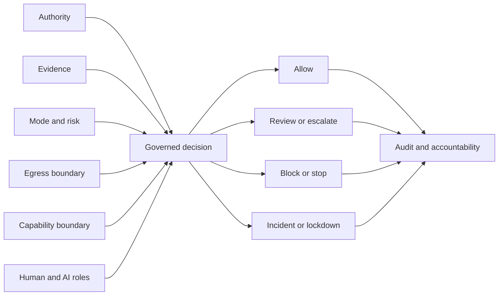

# Governance-First Security Architecture Project

The Governance-First Security Architecture Project is a documentation-only architecture project for controlling sensitive human- and AI-assisted decisions before technical capability is allowed to act.

The project asks a different first question:

```text
Not: What can the system do?

But: What is the system allowed to do,
under whose authority,
with what evidence,
in which mode,
with what egress boundary,
with whose accountability,
and when must it stop?
```

## About This Project

This is an independent project by Martin Dahl.

It is also a practical example of how I approach an ambiguous security and AI-governance problem: establish authority, evidence, decision boundaries, stop conditions, accountability, and review before discussing implementation.

The repository is intentionally documentation-first. It is open for critical review and further development, but it is not an implementation repository and does not claim that the model is secure, compliant, certified, production-ready, or commercially validated.

The canonical project source is `https://github.com/CarlMartinDahl/governance-first-security-architecture`. Independent forks and derivatives are welcome. They should remain distinguishable from official project revisions and must follow the applicable attribution and license terms for material they use.

## Current Status

| Area | Status |
| --- | --- |
| Repository | Documentation only |
| Documentation package | Frozen for external review |
| External feedback | Received and logged |
| Targeted external review | Partial |
| Commercial validation | Workshop and assessment discovery only |
| Prototype implementation | Not authorized |
| Production use | Not authorized |

## Model At A Glance



The model treats a stop state as a valid governance outcome, not a system failure.

Its recurring control pattern is:

```text
Authority + evidence + mode + risk + egress + accountability
before governed action.
```

## What The Model Covers

- decision authority and role separation,
- evidence quality, source authority, staleness, and counter-evidence,
- ingress and egress as separate control boundaries,
- explicit allow, review, block, quarantine, lockdown, and incident outcomes,
- AI recommendation versus human review, approval, and accountability,
- capability-change gates,
- audit and decision traceability,
- recovery and rollback expectations,
- synthetic-only test and prototype boundaries,
- restrained legal, regulatory, security, and commercial language.

## Practical Use Boundary

This repository is review and thinking material, not deployable software.

| Appropriate use | Current boundary |
| --- | --- |
| Challenge an AI, security, or governance design | Supported as a critical review lens |
| Run a decision assessment for one sensitive AI-assisted workflow | Intended commercial-discovery use through the bounded workshop offer |
| Reuse concepts such as stop states, role boundaries, decision matrices, or egress classes | Permitted under CC BY-SA 4.0 with attribution and share-alike obligations where applicable |
| Deploy the documentation as a live control plane | Not supported or authorized |
| Claim security, GDPR compliance, EU AI Act compliance, certification, or production readiness | Prohibited by the project claim boundary |
| Build a prototype or operational system from the package | Not authorized while the documentation freeze remains active |

The primary review audience includes CISOs, AI-governance leads, legal and risk functions, security reviewers, and enterprise architects who need to explain decision authority, required evidence, stop conditions, egress limits, and accountability.

## Reading Paths

### Executive Path

1. [Executive Overview](Governance-First-Security-Architecture-Executive-Overview-v0.1.md)
2. [Technical Review Brief](Governance-First-Security-Architecture-Technical-Review-Brief-v0.1.md)
3. [External Review Checklist](Governance-First-Security-Architecture-External-Review-Checklist-v0.1.md)

### Technical Path

1. [Minimal Viable Governance Kernel](Governance-First-Security-Architecture-Minimal-Viable-Governance-Kernel-v0.1.md)
2. [Mode Model Normalization](Governance-First-Security-Architecture-Mode-Model-Normalization-v0.1.md)
3. [Stop-State Registry](Governance-First-Security-Architecture-Stop-State-Registry-v0.1.md)
4. [Decision-State Matrix](Governance-First-Security-Architecture-Decision-State-Matrix-v0.1.md)
5. [Threat Model](Governance-First-Security-Architecture-Threat-Model-v0.1.md)

### AI Governance Path

1. [AI-Human Governance](Governance-First-Security-Architecture-AI-Human-Governance-v0.1.md)
2. [Evidence And Source Policy](Governance-First-Security-Architecture-Evidence-And-Source-Policy-v0.1.md)
3. [Audit And Accountability](Governance-First-Security-Architecture-Audit-And-Accountability-v0.1.md)
4. [GDPR And EU AI Act Alignment](Governance-First-Security-Architecture-GDPR-EU-AI-Act-Alignment-v0.1.md)

### Commercial Discovery Path

1. [Governance Decision Assessment Workshop Offer](Governance-First-Security-Architecture-Governance-Decision-Assessment-Workshop-Offer-v0.1.md)
2. [Post-Review Revision Log](Governance-First-Security-Architecture-Post-Review-Revision-Log-v0.1.md)

The complete package is organized in [DOCUMENT-INDEX.md](DOCUMENT-INDEX.md).

## Current Safe Path

```text
1. Keep major model expansion frozen.
2. Invite critical external review.
3. Record feedback and blockers.
4. Test 2-3 tightly scoped paid assessments.
5. Do not build software unless review and evidence justify reopening the gate.
```

## Known Review Questions

- Does the model add enough value beyond existing security and governance frameworks?
- Is the governance kernel actually minimal?
- Are the stop-state names and older blocked-outcome names mapped clearly enough?
- Are the decision matrix and role model practical, or still too broad?
- What should be removed before any prototype discussion?
- Can the workshop create useful paid outcomes without software?

Open questions are review inputs. They are not implementation instructions.

## Contributing

Critical review, scope reduction, terminology corrections, missing risks, stronger claim boundaries, and source improvements are welcome.

Read [CONTRIBUTING.md](CONTRIBUTING.md) and [CODE_OF_CONDUCT.md](CODE_OF_CONDUCT.md) before opening an issue or pull request. Do not submit secrets, personal data, private reviewer material, real incidents, or implementation code.

Repository authority, derivative-work attribution, and official-project identity are defined in [GOVERNANCE.md](GOVERNANCE.md), [ATTRIBUTION.md](ATTRIBUTION.md), and [PROJECT-IDENTITY.md](PROJECT-IDENTITY.md).

## License

Except where otherwise noted, this documentation is licensed under [Creative Commons Attribution-ShareAlike 4.0 International](https://creativecommons.org/licenses/by-sa/4.0/).

Requested attribution: `Governance-First Security Architecture Project by Martin Dahl`.

The complete standard legal code is in [LICENSE](LICENSE). Project attribution, scope notes, third-party exclusions, and claim boundaries are in [NOTICE.md](NOTICE.md) and [ATTRIBUTION.md](ATTRIBUTION.md).

No software is currently included. If software is later authorized through the review gate, original project code is intended to use [Mozilla Public License 2.0](https://www.mozilla.org/MPL/2.0/). That future code license is not active and does not authorize implementation now.

## Originator And Canonical Maintainer

Martin Dahl

This repository is part concept package, part working portfolio: it shows the questions I ask, the boundaries I set, and how I turn uncertain ideas into material that can be challenged. Contributions are welcome, while official project revisions remain traceable to the canonical repository and its governance process.
